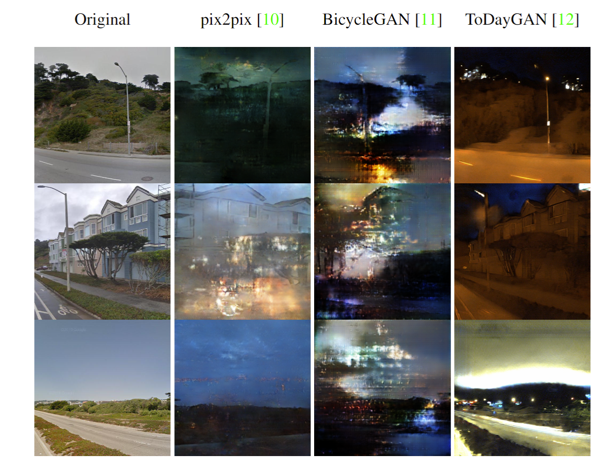

# Synthetic Images as Data Augmentation

Sample of images produced from sf-xs using translation models.



The results of VG using different translation models compared to Cosplace baseline.

| Dataset  | Cosplace | pix2pix aug R@1 | BicycleGAN aug R@1 | ToDayGAN R@1 |
| ------------- | ------------- | ------------- | ------------- | -------------|
| val sf | 83.7  | 82.9  | 83.3  | 83.3  |
| test sf | 54.7  | 52  | 51.5  | 50.6  |
| tokyo small | 73  | 68.3  | 68.9  | 73.7 |
| tokyo night | 56.2 | 48.6 | 53.3 | 67.6 | 

## For further implementation details:
<details open>
  <summary><strong>pix2pix</strong></summary>
  
Clone repo and install required libraries:
```bash
$ git clone https://github.com/junyanz/pytorch-CycleGAN-and-pix2pix
$ cd pytorch-CycleGAN-and-pix2pix
$ pip install -r requirements.txt
```
### <div align="center">Dataset</div>

Download night2day dataset from the repo:
```bash
$ bash ./datasets/download_pix2pix_dataset.sh night2day
```
If you want to create your own dataset, create folder /path/to/data with subdirectories A and B. A and B should each have their own subdirectories train, val, test, etc. In /path/to/data/A/train, put training images in style A. In /path/to/data/B/train, put the corresponding images in style B. Repeat same for other data splits (val, test, etc).

Corresponding images in a pair {A,B} must be the same size and have the same filename, e.g., /path/to/data/A/train/1.jpg is considered to correspond to /path/to/data/B/train/1.jpg.

Once the data is formatted this way, call:
```bash
$ python datasets/combine_A_and_B.py --fold_A /path/to/data/A --fold_B /path/to/data/B --fold_AB /path/to/data
```
This will combine each pair of images (A,B) into a single image file, ready for training.
### <div align="center">Train</div>
To train run: 

```bash
$ python train.py --dataroot ./datasets/night2day --name day2night --model pix2pix --direction BtoA --batch_size 32 --n_epochs 75 --n_epochs_decay 75
```
For further arguments' configurations and information refer to `options/base_options.py` and `options/train_options.py`.

To resume training add `--continue_train` and set `--checkpoints_dir` to the saved models' path and change `epoch_count` to the epoch you want to resume from.

### <div align="center">Testing</div>

To test images, make sure you have paired images (refer to **Dataset** Section), so if you are using your own dataset
```bash
$ python test.py --dataroot ./datasets/ --name day2night --num_test <nb of samples to augment> --model pix2pix --direction BtoA --checkpoints_dir <path>
```

### <div align="center">Augment SF-train</div>
To apply the augmentation run colab `pix2pix.ipynb`
	

</details>

<br>

<details open>
  <summary><strong>BicycleGAN</strong></summary>
 Install required libraries:
	
```bash
$ pip install torch
$ pip install torchvision
$ pip install visdom
$ pip install dominate
```
	
Clone repo:
	
```bash
$ git clone -b master --single-branch https://github.com/junyanz/BicycleGAN.git
$ cd BicycleGAN
$ pip install -r requirements.txt
```
	
### <div align="center">Dataset</div>
To download night2day call:
	
```bash
$ bash ./datasets/download_dataset.sh night2day
```
	
If you want to create your own dataset, copy `datasets/combine_A_and_B.py` from pix2pix repository, then create folder /path/to/data with subdirectories A and B. A and B should each have their own subdirectories train, val, test, etc. In /path/to/data/A/train, put training images in style A. In /path/to/data/B/train, put the corresponding images in style B. Repeat same for other data splits (val, test, etc).

Corresponding images in a pair {A,B} must be the same size and have the same filename, e.g., /path/to/data/A/train/1.jpg is considered to correspond to /path/to/data/B/train/1.jpg.

Once the data is formatted this way, call:
	
```bash
$ python datasets/combine_A_and_B.py --fold_A /path/to/data/A --fold_B /path/to/data/B --fold_AB /path/to/data
```
	
This will combine each pair of images (A,B) into a single image file, ready for training.
	
### <div align="center">Train</div>
To train run: 

```bash
$ python train.py --dataroot ./datasets/night2day --name day2night --direction BtoA --batch_size 32 --niter 75 --niter_decay 75
```
	
For further arguments' configurations and information refer to `options/base_options.py` and `options/train_options.py`.

To resume training add `--continue_train` and set `--checkpoints_dir` to the saved models' path and change `epoch_count` to the epoch you want to resume from.

### <div align="center">Testing</div>

To test images, make sure you have paired images (refer to **Dataset** Section), so if you are using your own dataset
	
```bash
$ python test.py --phase test --dataroot ./datasets/ --n_samples 1 --num_test <nb of samples to augment> --name day2night --direction BtoA --checkpoints_dir <path>
```

### <div align="center">Augment SF-train</div>
To apply the augmentation run colab `BicycleGAN.ipynb`
	

</details>
	
<br>

<details open>
  <summary><strong>ToDayGAN</strong></summary>
Install required libraries:
	
```bash
$ pip install torch
$ pip install torchvision
$ pip install visdom
$ pip install dominate	
```
	
Clone repo:
	
```bash
$ git clone https://github.com/AAnoosheh/ToDayGAN.git
$ cd ToDayGAN
```
	
### <div align="center">Dataset</div>	
Prepare test set `test` with subfolders `test0` for day images and `test1` empty (It is important to create `test1` even though it is empty so that the code doesn't crash)
### <div align="center">Download Pre-trained model</div>
Download pretrained model for Oxford RobotCars dataset [HERE](https://www.dropbox.com/s/mwqfbs19cptrej6/2DayGAN_Checkpoint150.zip?dl=0).


### <div align="center">Testing</div>


```bash
$ python test.py --phase test --serial_test --name day2night --dataroot ./datasets/ --n_domains 2 --which_epoch 150 --loadSize 512 --checkpoints_dir <path>
```

### <div align="center">Augment SF-train</div>
To apply the augmentation run colab `ToDayGAN.ipynb`
	

</details>
